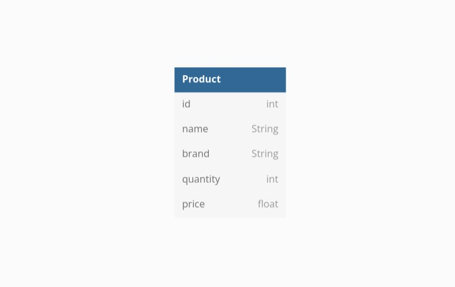
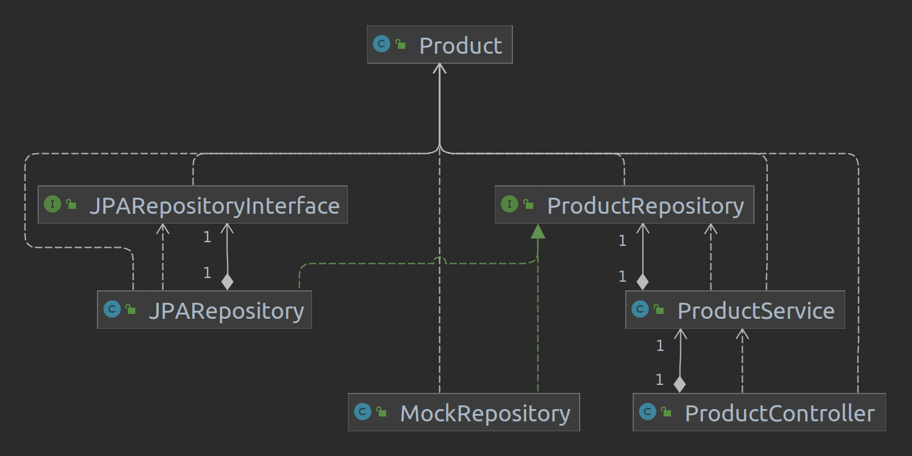

# Bike Shop Application

### Reference Documentation
 
This is a Spring application that is designed for a Bike Shop. It has a database containing 1 table (as of now) that
represents the products that the shop has in stock.

This application is organised in multiple layers, 3 to be exact: controller, service and repository layer.
Each layer is situated in its own package, just like the class that defines the object from the one table that we have
in the database.

The controller layers gets the requests from the user and it passes them on to the service layer. The service layer 
does the logic of the application like verifying that the entries are valid and such.
When all the logic is fulfilled the changes must then be forwarded to the database. This is done by the service layer
calling the repository layer, which is an interface but has some useful methods implemented.

I have implemented in the controller methods for GET, POST, DELETE and PUT. The GET method simply returns the 
specified table from the database. POST adds a new entry to a table, while DELETE removes one. The PUT method updates a 
row from a specific table; the new parameters can be of any number and can be in any order, this meaning that we can edit any field of any entry.

I have generated JavaDoc tags for all the classes and writtten descriptions for every item. After all of this I generated the JavaDoc document itself.

Moreover, I created test classes for every layer: controller, service and data layer. 
In the test class for the controller I verified that that the registration of a new product is done successfully by the controller class, helped by a connection to the service layer. 
In the service test class the verifications were done on the getProducts() method and for all the validations. 
Lastly, the test class for the repository layer checks other validations used indirectly by the service layer itself.
